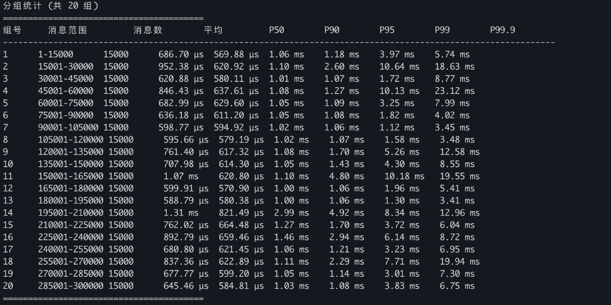

# Aeron

## 背景

目前的技术架构，为减少程序耦合，采用了[`aeron-rs`](https://github.com/UnitedTraders/aeron-rs)进行跨进程间通信；其中采用其共享内存的机制。因为Aeron协议是设计直接跑多种传输介质的，包含了共享内存/IPC, infiniBand/RDMA,UDP,TCP,Raw IP,HTTP,WebSocket,BLE。因此Aeron基于以下假设：

- 传输介质可以是流媒体，例如TCP或RDMA，而没有固有的帧边界。
- 传输介质可能仅具有单播模式。
- 长度为 16 位及以上的字段采用小端序。这主要是为了在对性能要求较高的平台上提高效率。由于字节被视为原子单位，因此无需考虑子字节序。

Aeron作为传输协议，可以在不可靠的介质上运行，作为OSI传输层（物理层/数据链路层/网络层/传输层/会话层/表示层/应用层）提供可靠的面向连接的数据流。因此必须接受一些额外的假设，Aeron会检测并纠正这些假设，例如：

- 可能会出现数据包重复的情况。
- 数据包可能会丢失。
- 包裹可能乱序送达。

因此，使用了基于日志的持久化存储，Publication和Subscription都基于内存映射文件。消息发送就可以追加到日志文件中，消费从日志文件中读取。类似于数据库的WAL的持久化保证。如果要追求极致的低延迟，还是需要显示配置允许丢消息（不发NAK消息，reliable=false）。

因此Aeron本身产生问题，通常和系统配置有关。常见排查步骤如下：

1.查看Aeron日志

2.查看空间状态`df -h /dev/shm`

3.检查系统参数`sysctl vm.max_map_count`和`ipcs -ls`

4.使用`aeron-stat`来诊断流状态和内部计数器。

## 高性能和高并发

核心思想：最大化顺序I/O,最小化竞争，零拷贝

每个Publication对应一个日志文件，只有一个写入者（线程）。因此可以完全无锁。且追加日志是最快的I/O模式而不是随机寻址。

零拷贝：共享内存+mmap+write。aeron通过共享内存和环形队列实现低延迟的数据传输。

## 性能数据实测

### 压测目的与总体思路

压测由 latency_pub.rs（发布端）与 latency_sub.rs（订阅端）配合完成，使用 Messaging 项目库基于 Aeron 验证消息端到端时延。
发布端以固定速率发送 Protobuf 消息，并在消息中携带发送时间戳。
订阅端在收到消息后取当前时间，与消息内时间戳相减得到单条消息端到端时延；随后统计平均值、最小/最大值以及多个百分位，并按时间顺序分组观测时延走势。

### 消息结构与时间戳携带方法

使用 protobuf 定义的 OrderInfo 作为负载。将纳秒级发送时间戳写入字段 strategy_order_id（i64）以便对端精确计算时延。
字节序列化与反序列化：

发布端：order.write_to_bytes()

订阅端：OrderInfo::parse_from_bytes(...)

发布端（latency_pub.rs）的压测逻辑

命令行参数：

dir_prefix: Aeron 共享内存目录

duration_secs: 运行时长秒数

rate_per_sec: 每秒发送条数

wait_secs: 启动后等待订阅端就绪的秒数

发送节奏控制：

计算总消息数 total_messages = duration_secs * rate_per_sec。

计算间隔 interval_ns = 1_000_000_000 / rate_per_sec。

发送过程：

每条消息生成发送时间戳（UNIX_EPOCH 纳秒），写入 strategy_order_id，序列化后发布。

订阅端（latency_sub.rs）的压测逻辑

命令行参数：

dir_prefix: Aeron 共享目录

total_messages: 计划接收的总条数

timeout_secs: 全局超时时间秒数

订阅与收包：

messaging.subscribe(topic, sender, stop) 将 Aeron 收到的二进制消息投递到内部crossbeam::channel。

订阅端以 recv_timeout(1s) 拉取消息；若超时则检查整体运行是否超过 timeout_secs，超时则退出并汇报已收条数。

时延计算：

收到消息时取当前纳秒时间 receive_time。

从消息中读出发送端写入的 send_time（strategy_order_id）。

计算单条时延：latency_ns = receive_time - send_time。
指标统计：

累计：总时延、最小/最大、保存全量单条时延数组以便后续排序求百分位。

平均时延：avg = total_latency / received_count。

百分位：对全量时延排序后取索引近似求 P50/P90/P95/P99/P99.9。

分组观测（时延随时间演化）：

将总消息按顺序均分为 NUM_GROUPS=20 组（最后一组可能不足整组）。

每组独立计算平均值与多个百分位，输出组号、消息范围与统计数据，便于观察阶段性变化。

压测结果：

在性能测试机器（当时暂未截取相关配置）上完成测试：

duration_secs 运行时长秒数 = 30

rate_per_sec 每秒发送条数 = 10000

如下图所示



### 高频场景推荐启动命令（后台运行+核心参数调优）

```bash
nohup ./aeronmd \
  -Daeron.dir=/dev/shm/aeron \                  # 共享内存目录（/dev/shm 是内存文件系统，比磁盘快100倍）
  -Daeron.ipc.mode=mmap \                       # IPC模式用mmap（默认，确保用户态零拷贝）
  -Daeron.udp.send.buffer.size=268435456 \      # UDP发送缓冲区256MB（默认仅2MB，避免高吞吐下缓冲区满）
  -Daeron.udp.receive.buffer.size=268435456 \   # UDP接收缓冲区256MB
  -Daeron.log.buffer.size=1073741824 \          # 日志缓冲区1GB（单段，默认64MB，适配10万+/秒订单吞吐）
  -Daeron.log.file.delete.on.exit=true \        # 进程退出时删除日志文件，避免内存泄漏
  -Daeron.publication.linger.time=0 \           # 发布者linger时间0ms（立即发送，降低延迟）
  -Daeron.subscription.linger.time=0 \          # 订阅者linger时间0ms（立即接收）
  -Daeron.driver.threading.mode=DEDICATED \     # 驱动线程模式：专用线程（避免共享线程调度抖动）,默认shared模式  
  -Daeron.driver.sender.thread.id=1 \           # Sender线程绑定CPU核心1
  -Daeron.driver.receiver.thread.id=2 \         # Receiver线程绑定CPU核心2
  -Daeron.driver.archive.thread.id=3 \          # Archive线程绑定CPU核心3
  -Daeron.heartbeat.interval=1000 \             # 心跳间隔1秒（减少心跳开销，高频场景无需短心跳）
  -Daeron.error.log.level=ERROR \               # 仅记录ERROR日志，避免日志IO拖慢性能
> aeronmd.log 2>&1 &
```

|参数|作用|
|---|---|
|aeron.dir=/dev/shm/aeron|共享内存放在内存文件系统，避免磁盘IO，IPC模式下消息传递延迟＜1μs|
|udp.send/receive.buffer.size|扩大UDP缓冲区，避免高吞吐（如10万订单/秒）下包丢失，同时减少内核态/用户态拷贝|
|log.buffer.size=1GB|日志缓冲区是Aeron的核心环形缓冲区，扩大后可容纳更多待处理消息，避免生产者阻塞|
|linger.time=0|关闭linger（默认50ms），消息立即发送/接收，牺牲少量吞吐量换极致延迟|
|threading.mode=DEDICATED|驱动用专用线程（发送/接收/归档各一个线程），避免线程调度导致的延迟抖动|

内核配置如下

```bash
# 1. 修改内核参数
cat >> /etc/sysctl.conf << EOF
# Aeron 高频调优
net.core.rmem_max = 268435456        # 最大UDP接收缓冲区（与aeronmd配置一致）
net.core.wmem_max = 268435456        # 最大UDP发送缓冲区
net.core.rmem_default = 268435456    # 默认UDP接收缓冲区
net.core.wmem_default = 268435456    # 默认UDP发送缓冲区
net.ipv4.tcp_mem = 268435456 268435456 268435456  # TCP内存（备用，Aeron主要用UDP）
net.ipv4.udp_mem = 268435456 268435456 268435456  # UDP内存限制
vm.max_map_count = 2000000           # 最大内存映射数（Aeron用mmap，默认65530不够）
vm.swappiness = 0                    # 禁用swap（避免共享内存换页，导致延迟陡增），默认60
fs.memory.max = 10737418240          # /dev/shm最大容量10GB（确保aeron.dir有足够空间）
EOF

# 2. 生效参数
sysctl -p

# 3. 调整文件句柄限制（避免Aeron打开过多文件描述符）
cat >> /etc/security/limits.conf << EOF
* soft nofile 1048576
* hard nofile 1048576
EOF

# 4. 立即生效文件句柄（当前会话）
ulimit -n 1048576
```

注意一定要禁用swap,否则会有磁盘极速抖动。

关于threading_mode大致情况如下

|模式名称|英文全称|核心原理|资源占用|延迟/抖动特性|
|---|---|---|---|---|
|INLINE|内联模式|驱动的所有操作（发送/接收）直接在应用线程内执行，无独立驱动线程|极低|延迟极不稳定（易被阻塞）|
|SHARED|共享模式|驱动的所有操作共享一个线程池（默认1-2线程），多应用共享线程资源|低|延迟中等，抖动较大|
|DEDICATED|专用模式|驱动的核心操作（发送、接收、归档、计时）各分配独立的专用线程|中|延迟极低，抖动极小（纳秒级）|
|OFFLOAD|卸载模式|基础操作（发送/接收）用SHARED，归档/重传等耗时操作卸载到专用线程|中|延迟中等，抖动低于 SHARED|

### DEDICATED 模式的核心优势（完美适配高频）

DEDICATED 模式为驱动的每个核心操作分配独立的专用线程，且这些线程可绑定到独占的CPU核心（避免调度），从根源上消除线程切换和任务排队的开销：

线程模型：“一操作一线程”，无资源竞争

DEDICATED 模式下，Aeron Media 会创建 3个专用线程（可配置）：

- Sender Thread：仅处理消息发送（如订单状态上报）；
- Receiver Thread：仅处理消息接收（如策略发单）；
- Archive Thread：仅处理日志归档（可选）；
- Timer Thread：仅处理心跳 / 超时（可选）。

每个线程只做一件事，无任务切换，CPU 缓存命中率接近 100%（高频场景下缓存命中是延迟的核心影响因素）。

其他模式

- INVOKER: 不使用线程，客户端调用MediaDriver.Context.driverAgentInvoker()来完成任务。
- SHARED：共用一个线程。
- SHARED_NETWORK：Sender和Reciver使用一个线程，Conductor单独使用一个线程。
- DEDICATED：每个操作使用一个专用线程。

### Idle Strategies

目前提供两种策略来在空闲时

- BusySpinIdleStrategy ：在空闲时忙等，无上下文切换，延迟极低（纳秒级）。
- YieldingIdleStrategy ：在空闲时让出CPU时间片，允许其他线程运行，延迟中等（微秒级）。

LowLatencyMediaDriver 会给 Conductor 使用 BusySpinIdleStrategy; Sender和Reciver使用NoOpIdleStrategy。并且使用DEDICATED模式。某些场景下Reciver也可以使用 BusySpinIdleStrategy来达到比较低的延迟。

### aeron.mtu.length

默认值其实就可以，如果大于接口的MTU值会导致数据报碎片化。并且结合rmem_max和wrem_max进行配置。

### vm.max_map_count

|Aeron 组件|对应的 mmap 区域数量|高频场景下的映射数|
|---|---|---|
|共享内存环形缓冲区（Log Buffer）|每个缓冲区至少1个（分片则多段对应多个）|1GB缓冲区拆分为16段→16个mmap 区域|
|CNC 文件（Control-Network-Control）|1个（存储 Aeron 驱动的控制信息）|固定1个|
|Publication/Subscription|每个发布/订阅通道至少1个|对接 10 个策略节点 + 5 个券商 → 至少 15 个|
|Aeron Cluster 日志归档|每个集群节点至少2个|3 节点集群→6个|

```bash
# 查看系统当前配置
sysctl vm.max_map_count

# 查看指定进程（如aeronmd）的实际mmap区域数量（关键验证）
cat /proc/$(pidof aeronmd)/maps | wc -l
# 输出示例：1258 → 说明aeronmd当前用了1258个mmap区域，远低于200万上限
```

等我们完成了上述修改后，对aeron进行之前的测试。其中将原本使用的idleStrategy从Sleep切换为Spin。

### Aeron + Cap'n Proto 延迟测量示例（单进程两线程）

aeron启动使用如下参数。

```bash
/root/aeron/bin/aeronmd -DAERON_DIR=/dev/shm/aeron/ \
  -Daeron.log.file.delete.on.exit=true \
  -Daeron.publication.linger.time=0  \
  -Daeron.subscription.linger.time=0 \
  -Daeron.driver.threading.mode=DEDICATED \
  -Daeron.driver.sender.thread.id=1 \
  -Daeron.driver.receiver.thread.id=2 \
  -Daeron.driver.archive.thread.id=3 \
  -Daeron.heartbeat.interval=1000 \
  -Daeron.error.log.level=ERROR
```

依赖

```toml
[package]
name = "aeron_capnp_latency"
version = "0.1.0"
edition = "2024"

[dependencies]
aeron-rs = "0.1.8"
capnp = "0.23.0"
hdrhistogram = "7"

[build-dependencies]
capnpc = "0.23.2"
```

创建 Cap'n Proto的表格

```capnp
@0xb3e9b4e7fd4e3c9a;

struct LatencyMsg {
  sendTimeNs @0 :Int64;
  seq @1 :UInt64;
}
```

build.rs如下。

```rust
fn main() -> std::result::Result<(), Box<dyn std::error::Error>> {
    capnpc::CompilerCommand::new()
        .src_prefix("schema")
        .output_path("src")
        .file("schema/latency.capnp")
        .run()?;
    Ok(())
}
```

src/main.rs

```rust
use aeron_rs::aeron::Aeron;
use aeron_rs::concurrent::atomic_buffer::AtomicBuffer;
use aeron_rs::concurrent::logbuffer::header::Header;
use aeron_rs::context::Context;
use aeron_rs::publication::Publication;
use aeron_rs::subscription::Subscription;
use aeron_rs::utils::types::Index;
use hdrhistogram::Histogram;
use std::sync::Arc;
use std::sync::OnceLock;
use std::sync::atomic::{AtomicBool, AtomicU64, Ordering};
use std::thread;
use std::time::{Duration, Instant};
mod latency_capnp;
use aeron_rs::concurrent::strategies::Strategy;

// 默认10w条突发数据
const MSG_COUNT: u64 = 100_000;
static AERON_DIR: &str = "/dev/shm/aeron";
static AERON_CHANNEL: &str = "aeron:ipc";
const AERON_STREAM_ID: i32 = 1;
const BATCH_SIZE: i32 = 64;
static MONO_EPOCH: OnceLock<Instant> = OnceLock::new();

fn now_duration() -> Duration {
    let base = *MONO_EPOCH.get_or_init(Instant::now);
    base.elapsed()
}

fn encode(send_ns: i64, seq: u64) -> Vec<u8> {
    let mut message = ::capnp::message::Builder::new_default();
    let mut root = message.init_root::<crate::latency_capnp::latency_msg::Builder>();
    root.set_send_time_ns(send_ns);
    root.set_seq(seq);
    let mut buf = Vec::new();
    ::capnp::serialize::write_message(&mut buf, &message).unwrap();
    buf
}

fn decode(buf: &[u8]) -> (i64, u64) {
    let mut s = buf;
    let r = ::capnp::serialize::read_message_from_flat_slice(
        &mut s,
        ::capnp::message::ReaderOptions::new(),
    )
    .unwrap();
    let root = r
        .get_root::<crate::latency_capnp::latency_msg::Reader>()
        .unwrap();
    (root.get_send_time_ns(), root.get_seq())
}

fn main() {
    let aeron_dir = AERON_DIR;
    let channel = AERON_CHANNEL;
    let stream_id: i32 = AERON_STREAM_ID;
    let total_msgs: u64 = MSG_COUNT;
    let mut ctx = Context::new();
    ctx.set_aeron_dir(aeron_dir.to_string());
    let mut aeron = Aeron::new(ctx).unwrap();
    let channel_c = std::ffi::CString::new(channel).unwrap();
    let pub_id = aeron.add_publication(channel_c.clone(), stream_id).unwrap();
    let sub_id = aeron
        .add_subscription(channel_c.clone(), stream_id)
        .unwrap();
    let pub_arc: Arc<std::sync::Mutex<Publication>> = loop {
        match aeron.find_publication(pub_id) {
            Ok(p) => break p,
            Err(_) => {
                thread::sleep(Duration::from_millis(10));
            }
        }
    };
    let sub_arc: Arc<std::sync::Mutex<Subscription>> = loop {
        match aeron.find_subscription(sub_id) {
            Ok(s) => break s,
            Err(_) => {
                thread::sleep(Duration::from_millis(10));
            }
        }
    };

    let received = Arc::new(AtomicU64::new(0));
    let done = Arc::new(AtomicBool::new(false));
    let recv = {
        let sub = sub_arc.clone();
        let total = total_msgs;
        let received = received.clone();
        let done = done.clone();
        thread::spawn(move || {
            let mut latencies = Vec::with_capacity(total as usize);
            let idle_strategy = aeron_rs::concurrent::strategies::BusySpinIdleStrategy::default();
            loop {
                let mut handler =
                    |buffer: &AtomicBuffer, _offset: Index, length: Index, _header: &Header| {
                        let view = buffer.view(_offset, length);
                        let slice =
                            unsafe { std::slice::from_raw_parts(view.buffer(), length as usize) };
                        let (send_ns, _seq) = decode(slice);
                        let now = now_duration();
                        let send = Duration::from_nanos(send_ns as u64);
                        let lat = now.saturating_sub(send);
                        latencies.push(lat.as_nanos() as u64);
                        received.fetch_add(1, Ordering::Relaxed);
                    };
                let len = sub.lock().unwrap().poll(&mut handler, BATCH_SIZE);
                let _ = &idle_strategy.idle_opt(len);

                if done.load(Ordering::Relaxed) && received.load(Ordering::Relaxed) >= total {
                    break;
                }
            }
            latencies
        })
    };

    while !sub_arc.lock().unwrap().is_connected() {
        thread::sleep(Duration::from_millis(10));
    }
    let sender = {
        let pub_ = pub_arc.clone();
        thread::spawn(move || {
            let total = total_msgs;
            let mut seq = 0;
            while seq < total {
                let ts_ns = now_duration().as_nanos() as i64;
                let mut buf = encode(ts_ns, seq);
                let abuf = aeron_rs::concurrent::atomic_buffer::AtomicBuffer::wrap_slice(&mut buf);
                let _ = pub_.lock().unwrap().offer(abuf);
                seq += 1;
            }
        })
    };
    let _ = sender.join();
    done.store(true, Ordering::SeqCst);
    let latencies = recv.join().unwrap();
    let mut h = Histogram::<u64>::new(3).unwrap();
    for v in latencies {
        let _ = h.record(v);
    }
    let p50 = h.value_at_percentile(50.0);
    let p90 = h.value_at_percentile(90.0);
    let p99 = h.value_at_percentile(99.0);
    println!("p50 {} ns", p50);
    println!("p90 {} ns", p90);
    println!("p99 {} ns", p99);
    println!("mean {} ns", h.mean());
    println!("count {}", h.len());
}
```

运行测试结果如下：

|发送线程数量|接受线程数量|p50|p90|p99|数据量|
|---|---|---|---|---|---|
|1|1|1143 ns|1543 ns|3427 ns|100000|
|1|1|1093 ns|1864 ns|11759 ns|100000|
|1|1|1081 ns|1413 ns|5603 ns|100000|
|1|1|862 ns|1312 ns|3377 ns|100000|
|1|1|1032 ns|1684 ns|8687 ns|100000|
|1|1|832 ns|1302 ns|7847 ns|100000|
|1|1|833 ns|1363 ns|7535 ns|100000|
|1|1|1072 ns|1504 ns|7567 ns|100000|
|1|1|842 ns|1352 ns|7627 ns|100000|
|1|1|1012 ns|1323 ns|8175 ns|100000|

参数切换后，测试结果如下：

|发送线程数量|接受线程数量|p50|p90|p99|数据量|
|---|---|---|---|---|---|
|1|1|1021 ns|1554 ns|6403 ns|100000|
|1|1|1011 ns|1513 ns|10551 ns|100000|
|1|1|841 ns|1162 ns|3387 ns|100000|
|1|1|1022 ns|1503 ns|6955 ns|100000|
|1|1|852 ns|1202 ns|4591 ns|100000|
|1|1|842 ns|1192 ns|5803 ns|100000|

仍然存在较大的毛刺

```bash
sudo strace -c ./aeron_capnp_latency
^Cstrace: Process 1576000 detached
% time     seconds  usecs/call     calls    errors syscall
------ ----------- ----------- --------- --------- ------------------
 99.91    1.229840          29     42367         4 futex
  0.02    0.000292          15        19           mmap
  0.01    0.000140          23         6           openat
  0.01    0.000114          14         8           mprotect
  0.01    0.000111          15         7           read
  0.00    0.000056          56         1           clone3
  0.00    0.000055           9         6           close
  0.00    0.000054          10         5           newfstatat
  0.00    0.000041           6         6           rt_sigaction
  0.00    0.000039          13         3           statx
  0.00    0.000038          12         3           brk
  0.00    0.000037           9         4           pread64
  0.00    0.000021          21         1           munmap
  0.00    0.000021           7         3           rt_sigprocmask
  0.00    0.000021          21         1         1 access
  0.00    0.000020          10         2         1 arch_prctl
  0.00    0.000018           9         2           prlimit64
  0.00    0.000017          17         1           poll
  0.00    0.000017           8         2           sigaltstack
  0.00    0.000015           7         2           getrandom
  0.00    0.000009           9         1           sched_getaffinity
  0.00    0.000009           9         1           rseq
  0.00    0.000008           8         1           set_tid_address
  0.00    0.000008           8         1           set_robust_list
  0.00    0.000000           0         1           execve
------ ----------- ----------- --------- --------- ------------------
100.00    1.231001          28     42454         6 total
```
