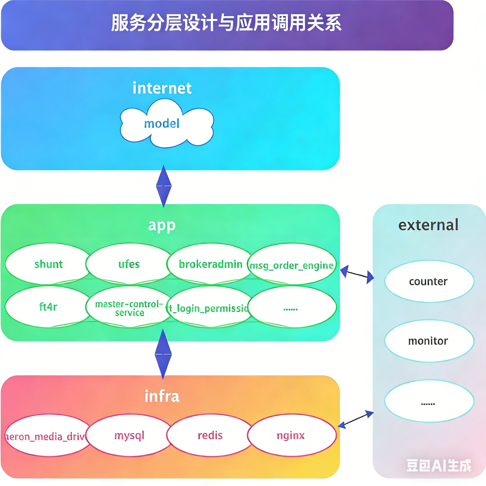
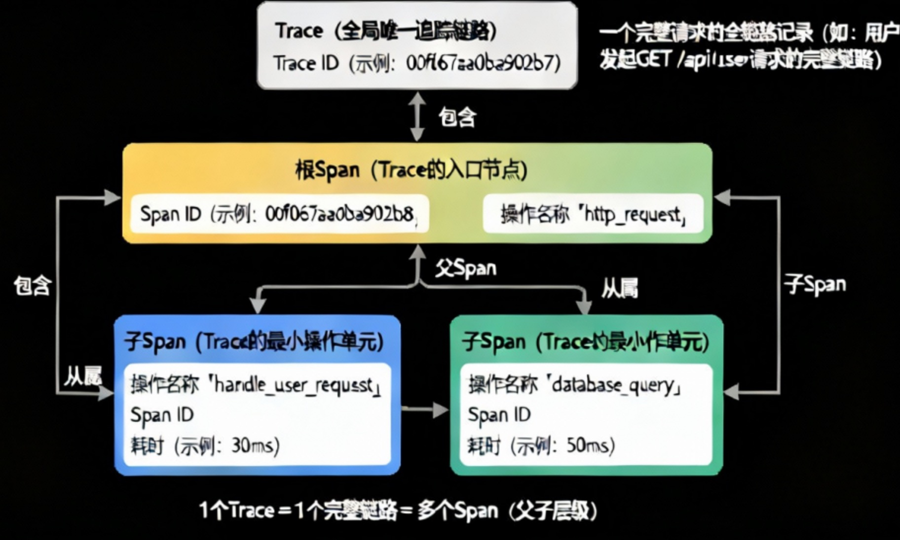

# 分布式链路追踪性能调优-基于OpenTelemetry与Rust的实践

## 背景与目标

分布式系统的性能痛点

- 分布式架构下链路追踪的核心价值（问题定位、性能瓶颈排查、全链路可观测性）

- 性能调优的核心诉求：低侵入性、低开销、高准确性（避免追踪本身成为性能负担）



例如子单下单场景，从ufes->aeron->risk_control->msg_order_engine->redis->counter，实际的一个业务场景的调用链是很长的；可能各个环节都需要对redis/mysql进行多次的调用访问；各模块调用者负责自己的业务开发，但是对于公共组件的使用几乎不进行维护，而redis的单模型可能因为上层的业务调用导致下层的业务调用延迟很高（假设上层异步执行了scan命令，下游同步执行时会出现极大延迟）。

APM（Application Performance Monitoring）是一种用于监控和分析应用程序性能的工具。它可以帮助开发人员和运维团队识别和解决应用程序中的性能问题，确保应用程序在生产环境中的稳定性和性能。

## OpenTelemetry简介

[OpenTelemetry](https://opentelemetry.opendocs.io/docs/)，前身为[OpenTracing](https://opentracing.io/specification/)和[OpenCensus](https://opencensus.io/quickstart/cpp/tracing/)合并而来，简称```OTel```，是一个观测性框架和工具包，旨在创建和管理遥测数据，如追踪(Trace)、指标(Metric)和日志(Log)。OpenTelemetry是厂商和工具无关的，意味着它可以与各种观测性后端一起使用，包括像Jaeger和Prometheus这样的开源工具，以及商业解决方案。


OpenTelemetry就是解决是提供一套标准化接口或协议完成分布式系统的观测性需求。OpenTelemetry关注于遥测数据的生成、收集、管理和导出。存储和可视化数据留给其他工具。

### 主要组件

OpenTelemetry包括以下主要组件：

- 用于所有组件的规范。
- 定义遥测数据形状的标准协议。
- 为常见遥测数据类型定义标准命名方案的语义约定。
- 定义如何生成遥测数据的API。
- 实现规范、API和遥测数据导出的语言SDK。
- 实现常见库和框架的仪表化的库生态系统。
- 无需更改代码生成遥测数据的自动仪表化组件。
- OpenTelemetry Collector：接收、处理和导出遥测数据的代理。
- 其他各种工具，例如OpenTelemetry Operator for Kubernetes、OpenTelemetry Helm Charts和用于FaaS的社区资产。

### 核心概念

#### Trace（追踪）

分布式链路中一个完整请求的全链路记录，全局唯一标识（Trace ID）贯穿始终，串联起请求从入口（如 Rust 程序接收 HTTP 请求）到出口（如响应返回）的所有相关操作，是排查全链路问题、分析端到端性能的核心载体。

```rust
// Rust+OTel 中Trace的隐式创建（通过根Span触发，自动生成Trace ID）
use tracing::{info, span, Level};
use tracing_opentelemetry::OpenTelemetryLayer;

#[tokio::main]
async fn main() {
    // 初始化OTel（省略基础配置，后续章节详细展开）
    init_otel();
    // 根Span创建，触发Trace生成（Trace ID自动生成并贯穿所有子Span）
    let root_span = span!(Level::INFO, "http_request", method = "GET", path = "/api/user");
    let _enter = root_span.enter(); // 进入根Span，后续操作均关联此Trace
    info!("处理请求开始");
    handle_user_request().await; // 子操作，会继承当前Trace
    info!("处理请求结束");
    // 程序退出时，Trace数据自动导出，包含所有关联Span
    opentelemetry::global::shutdown_tracer_provider();
}

async fn handle_user_request() {
    let sub_span = span!(Level::INFO, "handle_user_request");
    let _enter = sub_span.enter();
    info!("查询用户信息");
}
```

#### Span（跨度）

Trace 的最小可操作单元，代表链路中一个具体的独立操作（如 Rust 函数调用、数据库查询、RPC 调用、OTel 自身的采集操作），包含开始 / 结束时间、操作名称、属性（如请求参数）、耗时等信息，多个 Span 按依赖关系组合成完整 Trace。

```rust
// Rust+OTel 中Span的创建、属性设置、耗时统计
use tracing::{span, Level};
use tracing_opentelemetry::OpenTelemetryLayer;

// 单个Span示例（独立操作，可作为子Span关联到Trace）
fn query_database(sql: &str) {
    // 创建Span，指定操作名称和关键属性（便于后续性能分析）
    let db_span = span!(
        Level::INFO,
        "database_query",
        sql = sql,
        db_type = "mysql"
    );
    let _enter = db_span.enter(); // 进入Span，开始计时
    
    // 模拟数据库查询操作
    std::thread::sleep(std::time::Duration::from_millis(50));
    
    // 退出Span（自动计算耗时，无需手动结束）
}

// 子Span示例（关联到父Span，继承Trace ID）
#[tokio::main]
async fn main() {
    init_otel();
    let parent_span = span!(Level::INFO, "parent_operation");
    let _enter = parent_span.enter();
    
    query_database("SELECT * FROM users WHERE id = 1"); // 子Span，自动关联父Span
    
    opentelemetry::global::shutdown_tracer_provider();
}
```

### Context（上下文）

存储 Trace、Span 核心元数据（如 Trace ID、Span ID）的载体，是关联不同 Span、保证链路连贯的基础，相当于链路的 “身份凭证”，OpenTelemetry 中会封装为上下文对象，供 Rust 程序读取和传递。

```rust
- // Rust+OTel 中Context的获取与使用（获取当前Trace/Span元数据）
use opentelemetry::Context;
use tracing::{span, Level};
use tracing_opentelemetry::OpenTelemetryLayer;

#[tokio::main]
async fn main() {
    init_otel();
    let root_span = span!(Level::INFO, "root_operation");
    let _enter = root_span.enter();
    
    // 获取当前上下文（包含Trace ID、Span ID等元数据）
    let current_context = Context::current();
    // 从上下文中提取Span信息（可用于日志关联、自定义上报等）
    let current_span = current_context.span();
    let span_context = current_span.span_context();
    
    // 打印Trace ID和Span ID（验证上下文有效性）
    println!("当前Trace ID: {:?}", span_context.trace_id());
    println!("当前Span ID: {:?}", span_context.span_id());
    
    opentelemetry::global::shutdown_tracer_provider();
}

// 初始化OTel（极简版，后续章节详细展开）
fn init_otel() {
    let tracer = opentelemetry_otlp::new_pipeline()
        .tracing()
        .with_exporter(opentelemetry_otlp::new_exporter().tonic())
        .install_simple()
        .unwrap();
    tracing_subscriber::registry()
        .with(OpenTelemetryLayer::new(tracer))
        .init();
}
```

### 采样率

用于控制 “哪些 Trace 会被采集、上报” 的比例（如 10%、50%、100%），核心目的是降低链路追踪自身的性能损耗—— 避免高并发场景下全量采集 Span 数据，导致 Rust 程序 CPU / 内存开销激增，可通过 OpenTelemetry SDK 配置（固定采样、动态采样等）。

```rust
- // Rust+OTel 中采样率配置（固定采样率、自定义采样示例）
use opentelemetry::sdk::trace::Sampler;
use opentelemetry_otlp::new_pipeline;
use tracing_subscriber::prelude::*;

// 1. 固定采样率配置（如10%采样，仅采集10%的Trace）
fn init_otel_fixed_sampler() {
    let tracer = new_pipeline()
        .tracing()
        // 配置固定采样率（0.1代表10%，1.0代表100%，0.0代表不采样）
        .with_sampler(Sampler::TraceIdRatioBased(0.1))
        .with_exporter(opentelemetry_otlp::new_exporter().tonic())
        .install_simple()
        .unwrap();
    
    tracing_subscriber::registry()
        .with(tracing_opentelemetry::OpenTelemetryLayer::new(tracer))
        .init();
}

// 2. 自定义采样器（简单示例：仅采样请求路径为/api/user的Trace）
struct CustomSampler;
impl Sampler for CustomSampler {
    fn should_sample(
        &self,
        _parent_context: Option<&opentelemetry::trace::SpanContext>,
        _trace_id: &opentelemetry::trace::TraceId,
        _name: &str,
        _kind: &opentelemetry::trace::SpanKind,
        _attributes: &[opentelemetry::KeyValue],
        _links: &[opentelemetry::trace::Link],
    ) -> opentelemetry::sdk::trace::SamplingResult {
        // 从属性中获取请求路径，判断是否采样
        let path = _attributes.iter().find(|kv| kv.key == "path");
        if let Some(kv) = path && kv.value.as_str() == Some("/api/user") {
            // 采样该Trace
            opentelemetry::sdk::trace::SamplingResult::RecordAndSample
        } else {
            // 不采样
            opentelemetry::sdk::trace::SamplingResult::Drop
        }
    }
}

// 使用自定义采样器
fn init_otel_custom_sampler() {
    let tracer = new_pipeline()
        .tracing()
        .with_sampler(Sampler::Custom(Box::new(CustomSampler)))
        .with_exporter(opentelemetry_otlp::new_exporter().tonic())
        .install_simple()
        .unwrap();
    
    tracing_subscriber::registry()
        .with(tracing_opentelemetry::OpenTelemetryLayer::new(tracer))
        .init();
}

```

### 链路上下文传递

在分布式系统（多服务）、Rust 程序内部（多线程、异步任务）中，传递 Context 元数据的过程，确保不同服务、不同操作的 Span 能关联到同一个 Trace（比如 Rust 异步任务中，将父 Span 的 Context 传递给子任务，避免链路断裂），是分布式链路追踪连贯的关键。

```rust
// Rust+OTel 中上下文传递（同步多线程、异步任务示例）
use opentelemetry::Context;
use tracing::{span, Level};
use tracing_opentelemetry::OpenTelemetryLayer;
use tokio::task;

#[tokio::main]
async fn main() {
    init_otel();
    let root_span = span!(Level::INFO, "root_operation");
    let _enter = root_span.enter();
    let current_context = Context::current(); // 获取当前上下文

    // 1. 异步任务中传递上下文（Rust异步重点，避免上下文丢失）
    let async_task = task::spawn_with_context(current_context.clone(), async move {
        // 异步任务中，上下文已传递，创建的Span自动关联原Trace
        let async_span = span!(Level::INFO, "async_task");
        let _enter = async_span.enter();
        tracing::info!("异步任务执行中");
        std::thread::sleep(std::time::Duration::from_millis(30));
    });

    // 2. 多线程中传递上下文
    std::thread::spawn(move || {
        // 手动设置当前线程的上下文
        let _guard = current_context.attach();
        // 线程中创建的Span自动关联原Trace
        let thread_span = span!(Level::INFO, "thread_task");
        let _enter = thread_span.enter();
        tracing::info!("多线程任务执行中");
    }).join().unwrap();

    async_task.await.unwrap();
    opentelemetry::global::shutdown_tracer_provider();
}

// 补充：tracing框架可自动传递上下文（简化写法）
async fn auto_pass_context() {
    let parent_span = span!(Level::INFO, "parent_async");
    let _enter = parent_span.enter();
    // tokio任务可自动继承tracing上下文（无需手动传递）
    let child_task = task::spawn(async {
        let child_span = span!(Level::INFO, "child_async");
        let _enter = child_span.enter();
        tracing::info!("自动继承上下文的异步子任务");
    });
    child_task.await.unwrap();
}
```

以下为对应例图。



## 实践检测：接入场景集成OpenTelemetry

### 集成目标

因为实际项目中迁扯的项目众多，目前仅对接入使用的场景进行归纳，提供使用和分析方法。

- 实现Rust程序（同步/异步）的链路数据采集、导出至Collector
- 该方法可完成真实的多进程调用链路跟踪，且代码侵入性小，性能影响小（至少测试环境可测）

### 环境准备

Rust版本、OTel Collector配置、可视化工具（如Jaeger）部署（极简配置，不展开）

### 代码实现（核心展示）

目前msg_order_engine组件的通信方式主要是gRPC和aeron的共享内存两种方式实现消息交互。

其中gRPC已有SDK实现，利用gRPC的元数据能力，只需要使用特定SDK的接口即可实现；

aeron是基于prost自定义通信协议，完成消息的序列化、反序列化等功能，原生并不支持OTel的上下文传递。

#### aeron代码展示

Cargo.toml配置依赖:

```toml
// 1. 依赖补充（Cargo.toml关键依赖，新增protobuf相关依赖）
prost = "0.12"
prost-build = "0.12"  # 用于编译protobuf文件
opentelemetry = "0.21"
tracing-opentelemetry = "0.21"
tracing-subscriber = { version = "0.3", features = ["env-filter", "json"] }
```

Protobuf消息定义（.proto文件，新增trace相关可选字段，不影响原有业务）

```proto
syntax = "proto3";
package user_service;
 
// 基础trace上下文字段（手动填入，用于链路关联）
message TraceContext {
    string trace_id = 1;  // 全局唯一Trace ID
    string span_id = 2;   // 当前Span ID（父Span ID，供服务端关联）
    bool sampled = 3;     // 采样标志（标记该Trace是否被采集）
}
 
// 业务请求消息（新增trace_context可选字段）
message UserRequest {
    uint64 user_id = 1;
    TraceContext trace_context = 2;  // 手动填入的trace上下文
}
 
// 业务响应消息（可选：返回trace上下文，便于后续链路延续）
message UserResponse {
    uint64 id = 1;
    string name = 2;
    string email = 3;
    TraceContext trace_context = 4;
}
```

rust代码如下

```rust
// 3. Rust端：编译protobuf后的代码（自动生成，核心字段使用）
// 注：通过prost-build编译上述.proto文件，生成对应Rust结构体
use prost::Message;
use user_service::{TraceContext, UserRequest, UserResponse}; // 自动生成的模块

// 4. 客户端：手动填入protobuf消息的trace相关字段（核心步骤）
use opentelemetry::{Context, trace::SpanContext};
use tracing::{span, Level};

async fn protobuf_client_call() {
    // 1. 创建当前操作的Span，关联全局Trace
    let client_span = span!(tracing::Level::INFO, "protobuf_client_call", service = "user_service");
    let _enter = client_span.enter();
    let current_context = Context::current();

    // 2. 从OTel上下文中提取trace_id、span_id、采样标志（核心：用于手动填入protobuf）
    let current_span_context = current_context.span().span_context();
    let trace_context = TraceContext {
        trace_id: current_span_context.trace_id().to_string(), // 转为字符串，适配protobuf字段
        span_id: current_span_context.span_id().to_string(),
        sampled: current_span_context.is_sampled(), // 采样标志，供服务端判断是否采集该链路
    };

    // 3. 构建protobuf业务请求，手动填入trace_context字段
    let mut request = UserRequest {
        user_id: 1,
        trace_context: Some(trace_context), // 手动填入，可选字段不影响原有业务
    };

    // 4. 序列化protobuf消息（内存协议传输，贴合实际场景）
    let mut buf = Vec::new();
    request.encode(&mut buf).unwrap();

    // 5. 发起跨进程/跨服务调用（内存协议传输buf，此处省略传输逻辑）
    let response_buf = send_proto_request(buf).await.unwrap();

    // 6. 反序列化响应，可选：提取响应中的trace_context延续链路（如需）
    let response = UserResponse::decode(&mut response_buf.as_slice()).unwrap();
    tracing::info!("protobuf调用成功，响应: {:?}", response);
}

// 5. 服务端：从protobuf消息中提取trace字段，关联父链路（核心步骤）
use opentelemetry::{propagation::TextMapPropagator, trace::TraceId, trace::SpanId};
use opentelemetry::sdk::trace::SpanContext as OtelSpanContext;

async fn handle_proto_request(buf: Vec<u8>) -> Result<Vec<u8>, Box<dyn std::error::Error>> {
    // 1. 反序列化protobuf消息
    let request = UserRequest::decode(&mut buf.as_slice())?;

    // 2. 从protobuf消息中提取trace_context字段（客户端手动填入的内容）
    let trace_context = match request.trace_context {
        Some(ctx) => ctx,
        None => {
            // 无trace上下文，创建新的Trace（兜底逻辑，避免链路断裂）
            let new_span = span!(Level::INFO, "proto_server_no_trace");
            let _enter = new_span.enter();
            tracing::warn!("未获取到客户端trace上下文，创建新Trace");
            let new_ctx = Context::current().span().span_context();
            TraceContext {
                trace_id: new_ctx.trace_id().to_string(),
                span_id: new_ctx.span_id().to_string(),
                sampled: new_ctx.is_sampled(),
            }
        }
    };

    // 3. 将提取的trace字段，转为OTel上下文，关联父链路（核心：实现链路连贯）
    let trace_id = TraceId::from_hex(&trace_context.trace_id)?;
    let span_id = SpanId::from_hex(&trace_context.span_id)?;
    // 构建OTel Span上下文（复用客户端传递的trace_id，保证同一链路）
    let parent_span_context = OtelSpanContext::new(
        trace_id,
        span_id,
        0, // 忽略trace_flags，可根据实际需求设置
        trace_context.sampled,
        None,
    );
    let parent_context = Context::new().with_span_context(parent_span_context);

    // 4. 基于父上下文创建服务端Span，自动关联客户端传递的Trace
    let server_span = parent_context.span(
        tracing::Level::INFO,
        "protobuf_server_get_user"
    );
    let _enter = server_span.enter();

    // 5. 执行业务逻辑（查询用户），后续操作均关联当前Trace
    let user = query_database(&format!("SELECT * FROM users WHERE id = {}", request.user_id));
    
    // 6. 构建响应，可选：填入当前服务端的trace上下文，供后续链路延续
    let current_span_context = Context::current().span().span_context();
    let response = UserResponse {
        id: user.id,
        name: user.name,
        email: user.email,
        trace_context: Some(TraceContext {
            trace_id: current_span_context.trace_id().to_string(),
            span_id: current_span_context.span_id().to_string(),
            sampled: current_span_context.is_sampled(),
        }),
    };

    // 7. 序列化响应消息，返回给客户端（内存协议传输）
    let mut response_buf = Vec::new();
    response.encode(&mut response_buf)?;
    Ok(response_buf)
}
// 关键备注：
// 1. protobuf消息中trace相关字段设为可选，不侵入原有业务逻辑，兼容无链路追踪的场景；
// 2. 字段填入/提取均手动实现，适配protobuf内存协议；
// 3. trace_id/span_id从OTel上下文中提取，保证与OTel链路数据一致，后续可正常在Jaeger可视化。
```

### gRPC代码展示

gRPC的跨进程上下文传递代码示例如下（基于tonic框架，贴合你的gRPC协议场景）

```rust
- // 1. 依赖补充（Cargo.toml关键依赖，贴合原有OTel依赖）
// tonic = { version = "0.10", features = ["tls"] }
// opentelemetry = "0.21"
// tracing-opentelemetry = "0.21"
// tracing-subscriber = { version = "0.3", features = ["env-filter", "json"] }

// 2. gRPC客户端：传递链路上下文（将当前Trace/Span上下文写入gRPC元数据）
use opentelemetry::Context;
use opentelemetry::propagation::TextMapPropagator;
use tonic::Request;
use tracing::span;

async fn grpc_client_call() {
    // 1. 创建当前操作的Span，关联全局Trace
    let client_span = span!(tracing::Level::INFO, "grpc_client_call", service = "user_service");
    let _enter = client_span.enter();
    let current_context = Context::current();

    // 2. 初始化gRPC客户端（示例，贴合你的业务gRPC客户端）
    let mut client = UserServiceClient::connect("http://127.0.0.1:50051").await.unwrap();

    // 3. 创建gRPC请求，将链路上下文写入元数据（核心步骤）
    let mut request = Request::new(UserRequest { user_id: 1 });
    let metadata = request.metadata_mut();
    
    // OTel propagator：提取上下文并写入元数据（自动处理trace_id、span_id等）
    let propagator = opentelemetry::global::propagator();
    propagator.inject_context(&current_context, &mut MetadataMap(metadata));

    // 4. 发起gRPC调用，链路上下文随元数据传递
    let response = client.get_user(request).await.unwrap();
    tracing::info!("gRPC调用成功，响应: {:?}", response.into_inner());
}

// 3. gRPC服务端：提取链路上下文（从gRPC元数据中提取，关联父Trace/Span）
use tonic::{Request, Response, Status, MetadataMap};
use opentelemetry::propagation::Extractor;

// 自定义元数据提取器，适配tonic的Metadata
struct MetadataExtractor<'a>(&'a tonic::MetadataMap);
impl&lt;'a&gt; Extractor for MetadataExtractor<'a> {
    fn get(&self, key: &str) -> Option<&str> {
        self.0.get(key).and_then(|val| val.to_str().ok())
    }
    fn keys(&self) -> Iterator<Item = &str> {
        self.0.keys().map(|key| key.as_str())
    }
}

// gRPC服务端实现（提取上下文，关联父链路）
#[tonic::async_trait]
impl UserService for UserServiceImpl {
    async fn get_user(&self, request: Request<UserRequest>) -> Result<Response<UserResponse>, Status> {
        // 1. 从gRPC元数据中提取链路上下文
        let metadata = request.metadata();
        let extractor = MetadataExtractor(metadata);
        let propagator = opentelemetry::global::propagator();
        let parent_context = propagator.extract(&extractor);

        // 2. 基于父上下文创建服务端Span，自动关联客户端传递的Trace
        let server_span = parent_context.span(
            tracing::Level::INFO,
            "grpc_server_get_user"
        );
        let _enter = server_span.enter();

        // 3. 执行业务逻辑（查询用户），后续操作均关联当前Trace
        let user = query_database(&format!("SELECT * FROM users WHERE id = {}", request.into_inner().user_id));
        
        // 4. 返回响应，链路上下文自动延续
        Ok(Response::new(UserResponse {
            id: user.id,
            name: user.name,
            email: user.email,
        }))
    }
}

// 关键备注：无需修改gRPC业务消息体，仅通过元数据传递上下文，侵入性极低
// 若业务需手动关联trace_id（如日志联动），可从上下文提取，无需写入消息体
```

### Derive代码展示

除了跨进程的协议，接入内部也采用了异步队列的消息方式，因此也需要对内部数据增加context上下文；目前可以使用宏做代码展开，类似于```#[derive(Debug, Clone)]```等方式，变化为```#[derive(Debug, Clone, Span)]```的方式。

实现trace_derive， Cargo.toml配置如下

```toml
[package]
name = "trace_derive"
version = "0.1.0"
edition = "2021"
proc-macro = true  # 标记为 proc-macro crate

[dependencies]
proc-macro2 = "1.0"
quote = "1.0"      # 生成 Rust 代码
syn = { version = "2.0", features = ["full", "extra-traits"] }  # 解析 Rust 语法树
tracing = "0.1"
opentelemetry = "0.21"
serde = { version = "1.0", features = ["derive"] }
```

（lib.rs实现 #[derive (Span)] 宏）

```rust
use proc_macro::TokenStream;
use proc_macro2::TokenStream as TokenStream2;
use quote::{quote, ToTokens};
use syn::{
    parse_macro_input, DeriveInput, Fields, Ident, Index, Type, TypePath,
};

// 定义 #[derive(Span)] 宏的入口
#[proc_macro_derive(Span, attributes(trace))]
pub fn derive_span(input: TokenStream) -> TokenStream {
    // 解析输入的结构体/枚举语法树
    let input = parse_macro_input!(input as DeriveInput);
    let name = input.ident;

    // 生成自动注入的代码
    let expanded = match input.data {
        syn::Data::Struct(s) => generate_struct_span_code(&name, &s.fields),
        syn::Data::Enum(_) => unimplemented!("暂不支持枚举类型，仅支持结构体"),
        syn::Data::Union(_) => unimplemented!("暂不支持联合体"),
    };

    // 将生成的代码转为 TokenStream 返回
    TokenStream::from(expanded)
}

/// 为结构体生成 Span 相关代码
fn generate_struct_span_code(name: &Ident, fields: &Fields) -> TokenStream2 {
    // 1. 为结构体注入隐式的 trace_context 字段（W3C Trace Context 标准）
    let trace_field = quote! {
        /// 自动注入的 Trace 上下文（由 #[derive(Span)] 生成）
        #[serde(rename = "_trace_context")]
        pub trace_context: ::trace_derive::TraceContext,
    };

    // 2. 拼接原有字段 + 注入的 trace_context 字段
    let struct_fields = match fields {
        Fields::Named(f) => {
            let named_fields = f.named.iter().map(|field| {
                let ident = &field.ident;
                let ty = &field.ty;
                quote! { #ident: #ty, }
            });
            quote! { { #(#named_fields)* #trace_field } }
        }
        Fields::Unnamed(f) => {
            let unnamed_fields = f.unnamed.iter().enumerate().map(|(i, field)| {
                let idx = Index::from(i);
                let ty = &field.ty;
                quote! { #idx: #ty, }
            });
            quote! { ( #(#unnamed_fields)* #trace_field ) }
        }
        Fields::Unit => quote! { ( #trace_field ) },
    };

    // 3. 生成 From<SpanContext> 实现（从当前 Span 提取上下文）
    let from_span_context = quote! {
        impl ::std::convert::From<::opentelemetry::trace::SpanContext> for #name {
            fn from(span_context: ::opentelemetry::trace::SpanContext) -> Self {
                let mut this = Self::default();
                this.trace_context = ::trace_derive::TraceContext::from(span_context);
                this
            }
        }
    };

    // 4. 生成 TryFrom<Self> 实现（解析 Trace 上下文）
    let try_from_self = quote! {
        impl ::std::convert::TryFrom<&#name> for ::opentelemetry::trace::SpanContext {
            type Error = String;

            fn try_from(msg: &#name) -> Result<Self, Self::Error> {
                ::std::convert::TryFrom::try_from(&msg.trace_context)
            }
        }
    };

    // 5. 生成创建关联 Span 的方法
    let create_span_method = quote! {
        impl #name {
            /// 自动生成：创建关联当前 Trace 上下文的 Span
            pub fn create_span(&self, span_name: &str) -> ::tracing::Span {
                let span_context = match ::opentelemetry::trace::SpanContext::try_from(self) {
                    Ok(ctx) => ctx,
                    Err(e) => {
                        ::tracing::warn!("解析 Trace 上下文失败: {}", e);
                        return ::tracing::span!(::tracing::Level::INFO, span_name);
                    }
                };
                ::tracing::span!(
                    ::tracing::Level::INFO,
                    span_name,
                    parent: &span_context,
                    trace_id = %span_context.trace_id(),
                    span_id = %span_context.span_id()
                )
            }
        }
    };

    // 6. 生成 Default 实现（方便快速初始化）
    let default_impl = quote! {
        impl ::std::default::Default for #name {
            fn default() -> Self {
                // 生成默认值（适配不同字段类型）
                #name #struct_fields
            }
        }
    };

    // 拼接所有生成的代码
    quote! {
        // 重新定义结构体（注入 trace_context 字段）
        #[derive(::serde::Serialize, ::serde::Deserialize, Debug)]
        pub struct #name #struct_fields

        // 生成各类实现
        #from_span_context
        #try_from_self
        #create_span_method
        #default_impl
    }
}

// ========== 供业务 crate 使用的 TraceContext 定义（内部复用） ==========
#[derive(Debug, Serialize, Deserialize, Clone)]
pub struct TraceContext {
    trace_id: String,
    parent_span_id: String,
    sampled: bool,
}

impl From<opentelemetry::trace::SpanContext> for TraceContext {
    fn from(span_context: opentelemetry::trace::SpanContext) -> Self {
        Self {
            trace_id: span_context.trace_id().to_string(),
            parent_span_id: span_context.span_id().to_string(),
            sampled: span_context.trace_flags().is_sampled(),
        }
    }
}

impl TryFrom<&TraceContext> for opentelemetry::trace::SpanContext {
    type Error = String;

    fn try_from(tc: &TraceContext) -> Result<Self, Self::Error> {
        let trace_id = opentelemetry::trace::TraceId::from_hex(&tc.trace_id)
            .map_err(|e| format!("解析 Trace ID 失败: {}", e))?;
        let parent_span_id = opentelemetry::trace::SpanId::from_hex(&tc.parent_span_id)
            .map_err(|e| format!("解析 Parent Span ID 失败: {}", e))?;
        let trace_flags = if tc.sampled {
            opentelemetry::trace::TraceFlags::SAMPLED
        } else {
            opentelemetry::trace::TraceFlags::DEFAULT
        };

        Ok(opentelemetry::trace::SpanContext::new(
            trace_id,
            parent_span_id,
            trace_flags,
            true,
            opentelemetry::trace::TraceState::default(),
        ))
    }
}
```

业务 crate 实现（使用 #[derive (Span)]）

Cargo.toml配置

```toml
[package]
name = "trace_demo"
version = "0.1.0"
edition = "2021"

[dependencies]
trace_derive = { path = "./trace_derive" }  # 依赖本地 proc-macro crate
tracing = "0.1"
tracing-subscriber = { version = "0.3", features = ["env-filter", "fmt", "thread-id"] }
tracing-opentelemetry = "0.22"
opentelemetry = { version = "0.21", features = ["rt-tokio", "trace"] }
opentelemetry-jaeger = "0.21"
tokio = { version = "1.0", features = ["full", "unix"] }
serde = { version = "1.0", features = ["derive"] }
serde_json = "1.0"
```

main.rs（业务代码，无需定义 TraceContext）

```rust
use serde::{Deserialize, Serialize};
use trace_derive::Span;
use tracing::{info, instrument};

// ========== 1. 只需在业务消息类型上 #[derive(Span)]，无需手动定义 TraceContext ==========
/// 跨进程消息（自动注入 trace_context 字段和 Span 相关方法）
#[derive(Span, Serialize, Deserialize, Debug)]  // 核心：#[derive(Span)]
pub struct CrossProcessMsg {
    // 仅需定义业务字段，Trace 上下文由宏自动注入
    pub content: String,
    pub msg_id: u64,
}

// ========== 2. 初始化 APM（复用之前的逻辑） ==========
fn init_apm(service_name: &str) {
    let jaeger_exporter = opentelemetry_jaeger::new_pipeline()
        .with_service_name(service_name)
        .with_agent_endpoint("127.0.0.1:6831")
        .install_batch(opentelemetry::runtime::Tokio)
        .expect("初始化 Jaeger 失败");

    let tracer = opentelemetry::global::tracer(service_name);
    let otel_layer = tracing_opentelemetry::OpenTelemetryLayer::new(tracer);

    let subscriber = tracing_subscriber::Registry::default()
        .with(tracing_subscriber::fmt::layer().with_thread_ids(true))
        .with(tracing_subscriber::EnvFilter::from_default_env())
        .with(otel_layer);

    tracing::subscriber::set_global_default(subscriber)
        .expect("设置 tracing 订阅者失败");
}

// ========== 3. 发送进程（自动提取 Span 上下文） ==========
#[instrument(name = "sender", level = "info")]
async fn send_msg(socket_path: &str) {
    init_apm("sender-service");

    // 1. 创建业务消息（无需手动处理 Trace 上下文）
    let mut msg = CrossProcessMsg {
        content: "Hello from sender!".to_string(),
        msg_id: 1001,
    };

    // 2. 自动提取当前 Span 上下文到消息中（宏生成的 From<SpanContext> 实现）
    let current_span_context = tracing::Span::current().context().span().span_context();
    msg.trace_context = trace_derive::TraceContext::from(current_span_context);
    info!("消息已注入 Trace 上下文: {:?}", msg);

    // 3. 模拟跨进程发送（UDS）
    let mut stream = tokio::net::UnixStream::connect(socket_path).await.expect("连接 UDS 失败");
    serde_json::to_writer(&mut stream, &msg).expect("序列化消息失败");
    info!("发送消息: msg_id={}, content={}", msg.msg_id, msg.content);
}

// ========== 4. 接收进程（自动关联 Span 上下文） ==========
#[instrument(name = "receiver", level = "info")]
async fn recv_msg(socket_path: &str) {
    init_apm("receiver-service");

    // 监听 UDS
    let listener = tokio::net::UnixListener::bind(socket_path).expect("绑定 UDS 失败");
    info!("接收进程启动，监听: {}", socket_path);

    while let Ok((mut stream, _)) = listener.accept().await {
        // 1. 反序列化消息（自动解析 Trace 上下文）
        let msg: CrossProcessMsg = serde_json::from_reader(&mut stream)
            .expect("反序列化消息失败");
        info!("收到消息: msg_id={}, content={}", msg.msg_id, msg.content);

        // 2. 自动创建关联的 Span（宏生成的 create_span 方法）
        let recv_span = msg.create_span("process_cross_process_msg");
        let _guard = recv_span.enter();

        // 3. 业务处理（链路自动关联到发送端）
        info!("处理跨进程消息，Trace ID: {}", recv_span.context().span().span_context().trace_id());
    }
}

// ========== 主函数 ==========
#[tokio::main]
async fn main() {
    let socket_path = "/tmp/demo_uds.sock";

    // 清理旧 UDS 文件
    if std::path::Path::new(socket_path).exists() {
        std::fs::remove_file(socket_path).expect("删除旧 UDS 失败");
    }

    // 启动接收进程
    let recv_path = socket_path.to_string();
    tokio::spawn(async move {
        recv_msg(&recv_path).await;
    });

    // 等待接收进程启动
    tokio::time::sleep(tokio::time::Duration::from_secs(1)).await;

    // 发送消息
    send_msg(socket_path).await;

    // 等待链路上报
    tokio::time::sleep(tokio::time::Duration::from_secs(2)).await;
    opentelemetry::global::shutdown_tracer_provider();
}
```

```#[derive (Span)]```的核心作用：

- 自动为 `CrossProcessMsg` 注入 `trace_context`: `TraceContext` 字段（无需手动定义）；
- 自动生成 `From<SpanContext>` 实现：从当前 `Span` 提取上下文到消息中；
- 自动生成 `TryFrom<&Self>` 实现：从消息解析 `Trace` 上下文；
- 自动生成 `create_span()` 方法：一键创建关联父 `Span` 的子 `Span`。

业务代码简化点：

- 无需手动定义 `TraceContext` 结构体；
- 无需手动实现序列化 / 反序列化 `Trace` 上下文；
- 无需手动拼接 `Span` 上下文，仅需调用 `msg.create_span()` 即可关联链路。

宏的灵活性：

- 适配任意结构体（命名字段 / 元组字段 / 单元结构体）；
- 结合 serde 自动序列化 Trace 上下文，适配跨进程传输；
- 生成的代码符合 W3C Trace Context 标准，兼容主流 APM 平台。

### Jaeger效果演示

启动Jaeger:

```sh
docker run -d --name jaeger -p 6831:6831/udp -p 16686:16686 jaegertracing/all-in-one:latest
```

运行Derive的业务代码demo：

```sh
RUST_LOG=debug cargo run
```

访问Jaeger UI

能看到 sender-service 和 receiver-service 的完整链路；

消息的 Trace ID 全局一致，Span 自动关联，无需手动处理上下文。

### 案例分析

参考XX之前介绍的文档[数据库性能优化和ORM切换分享](https://doc.weixin.qq.com/doc/w3_AcUAKwZwAG0CNIYU2D7tPR6GxKmt8?scode=ALMAHgdeAAwGvKzmvuAcUAKwZwAG0)的慢查询，我们可以实时监控对应的查询性能。

可以参考这个链接[Opentelemetry实践分享-Golang篇](https://cloud.tencent.com/developer/article/2318616)。

## 扩展阅读

[OpenTelemetry 实战指南：从入门到精通 | Rust 应用监控实战](https://mp.weixin.qq.com/s/OOiJMxl1RgoKCVLOCuYxWw)

[揭秘微服务链路盲区：如何用OpenTelemetry+Jaeger实现全栈追踪？](https://blog.csdn.net/LiteCode/article/details/154878918)
