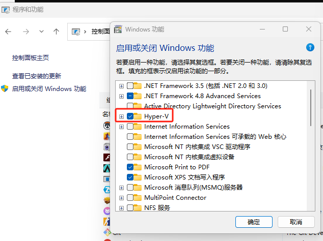
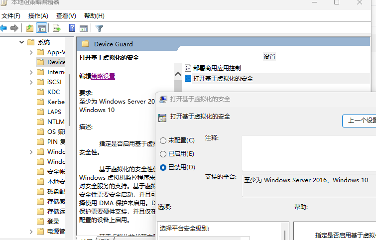

# 环境搭建

## wsl安装

### 安装流程

当前环境为Windows 11，使用WSL2安装Ubuntu系统。

安装WSL，指令为：`wsl --install`

检查当前wsl版本，使用的编辑器为trae，需要wsl 2。指令为：`wsl -l -v`

完成后尝试拉起，指令为：`wsl`

如果提示如下，则有后续配置：

```shell
当前计算机配置不支持WSL2.
请启用“虚拟化平台”可选组件，并确保在BIOS中启用虚拟化。
通过运行以下指令启用“虚拟机平台”: wsl.exe --install --no-distribution
有关信息，请访问https://aka.ms/enablevirtualization
Error code: Wsl/Service/CreateInstance/CreateVm/HCS/HCS_E_HYPERV_NOT_INSTALLED
```

### 启用Hyper-V

通过 控制面板->程序->卸载程序->启用或关闭Windows功能->Hyper-V，可以找到，勾选即可。



### 执行powershell

```powershell
bcdedit /set hypervisorlauchtype auto
```

### 关闭组策略配置

编辑组策略->本地计算机策略->计算机配置->管理模板->系统->Device Guard

将“打开基于虚拟化的安全”设置为“已禁用”



重启后运行wsl即可

## IDE Trae 搭建

先去[Trae 官网](https://www.trae.cn/)或[Trae 英文官网](https://www.trae.ai/)下载安装windows版本后

## claude cli安装

```shell
curl -fsSL https://claude.ai/install.sh | bash
curl -o- https://raw.githubusercontent.com/nvm-sh/nvm/v0.40.1/install.sh | bash
nvm install node
npx ccwx
```

### 安装rust

执行命令如下安装指令，采用国内rustup更快

```shell
export RUSTUP_DIST_SERVER=https://mirrors.ustc.edu.cn/rust-static
export RUSTUP_UPDATE_ROOT=https://mirrors.ustc.edu.cn/rust-static/rustup
# 清华源
export RUSTUP_DIST_SERVER=https://mirrors.tuna.tsinghua.edu.cn/rustup
export RUSTUP_UPDATE_ROOT=https://mirrors.tuna.tsinghua.edu.cn/rustup/rustup
# 上海交通大学镜像源
export RUSTUP_DIST_SERVER=https://mirrors.sjtu.edu.cn/rust-static
export RUSTUP_UPDATE_ROOT=https://mirrors.sjtu.edu.cn/rust-static/rustup
# 字节跳动镜像源
export RUSTUP_DIST_SERVER=https://rsproxy.cn
export RUSTUP_UPDATE_ROOT=https://rsproxy.cn/rustup
# 阿里云镜像源
export RUSTUP_DIST_SERVER=https://mirrors.aliyun.com/rustup
export RUSTUP_UPDATE_ROOT=https://mirrors.aliyun.com/rustup/rustup
# 华为云镜像源
export RUSTUP_DIST_SERVER=https://mirrors.huaweicloud.com/rustup
export RUSTUP_UPDATE_ROOT=https://mirrors.huaweicloud.com/rustup/rustup
curl --proto '=https' --tlsv1.2 https://sh.rustup.rs -sSf | sh
```

根据脚本提示，完成安装即可。

安装成功后，将环境变量生效。

```shell
. "$HOME/.cargo/env"
```

## 国内源切换

安装完成后，可能设计crate源的问题，也可以切换国内源

```shell
vim $HOME/.cargo/config
```

配置如下内容

```shell
[source.crates-io]
replace-with = 'ustc'
[source.ustc]
registry = "sparse+https://mirrors.ustc.edu.cn/crates.io-index/"
[registries.ustc]
index = "sparse+https://mirrors.ustc.edu.cn/crates.io-index/"
[net]
git-fetch-with-cli = true
```

### 插件安装

下载vscode及插件，仅做推荐（个人习惯，选择各自适合的IDE即可)

rust-analyzer //rust插件

Even Better TOML //支持TOML文件完成特性

Error Lens //更好的获取错误展示

One Dark Pro // VSCode主题

CodeLLDB // Debugger程序

RISC-V Debugger // 交叉编译使用

MarkDownLint // 编写markdown的lint语法检查

### rustup更新

如果本地没有安装rust和rustup

```shell
rustup update stable
```

指定特定rust版本

```shell
rustup show rustup default 1.88.0
```
