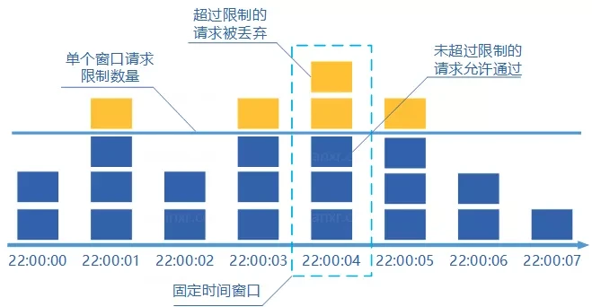
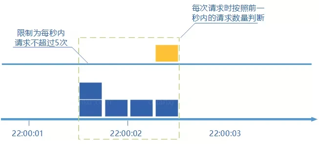

# 限流算法

## 背景

限流(Rate Limiting)是一种用于保护系统资源管理的一种策略，用于控制对某个服务、接口或功能的访问速率。它的主要目的是防止过度的请求或流量超过系统的处理能力，从而保护系统的稳定性、可靠性和安全性。

在实际业务的柜台接入开发中，上游系统没有流控设计，会导致大量的请求在某一时刻激增，而柜台通常无法承受如此大的并发，从而导致用户登录失败。因此需要流控，对这些请求进行限制。

## 常见限流算法

### 漏桶算法

系统请求先进入漏桶，再从漏桶中逐一取出请求执行，控制漏桶的流量。原理容易理解：我们从一个水桶的底部按照固定的水流速度滴水；无论有多少水流入桶中，水桶的出水速度是固定的。对应到系统中，就是按照固定的速率处理请求。但是如果瞬时的请求数量很大，桶的容量有限，最终会导致后续请求被丢弃或拒绝；同步版本代码实现如下。其他crate可参考[ratelimit_meter](https://docs.rs/ratelimit_meter/latest/ratelimit_meter/)。

```rust
use std::time::{Instant, Duration};
use std::cmp::max;

struct LeakyBucket {
    capacity: i32,      // 桶容量
    rate: f64,          // 令牌生成速率，单位每秒
    water_level: i32,   // 水位
    last_time: Instant, // 上一次水位更新时间
}

impl LeakyBucket {
    fn new(capacity: i32, rate: f64) -> Self {
        LeakyBucket {
            capacity,
            rate,
            water_level: 0,
            last_time: Instant::now(),
        }
    }

    fn allow_request(&mut self, amount: i32) -> bool {
        let current = Instant::now();
        let elapsed = current.duration_since(self.last_time).as_secs_f64();
        let leaky_amount = (elapsed * self.rate) as i32;
        self.water_level = max(0, self.water_level - leaky_amount);
        // 如果水位会有所下降，则更新时间戳
        if leaky_amount > 0 {
            self.last_time = current;
        }
        if self.water_level + amount <= self.capacity {
            self.water_level += amount;
            return true;
        }
        return false;
    }
}

fn main() {
    let mut bucket = LeakyBucket::new(3, 20.0);
    for i in 0..15 {
        if bucket.allow_request(1) {
            println!("request {} success", i);
        } else {
            println!("request {} failed", i);
        }
        std::thread::sleep(Duration::from_millis(45));
    }
}
```

实际业务代码里比较常见的unbounded版如下。

```rust
use std::sync::mpsc;
use std::time::Duration;

fn main() {
    let (tx, rx) = mpsc::channel::<i32>();
    // 假设一次性发送10个请求
    let handle = std::thread::spawn(move || {
        for i in 0..10 {
            let _ = tx.send(i);
        }
    });

    handle.join().unwrap();

    // 接受线程就使用main线程，处理完退出即可
    while let Ok(data) = rx.recv() {
        println!("recv data: {}", data);
        std::thread::sleep(Duration::from_millis(100));
    }

    println!("main thread exit");
}
```

### 令牌桶算法

系统请求会得到一个令牌，从令牌桶中取出一个令牌执行，控制令牌桶中令牌的数量。它的算法其实和漏桶原理类似，令牌桶按固定速率往桶内放入令牌，只要从桶内获取到令牌则认为请求通过。

也就是说，不管现在请求量是多是少，都有一个线程以固定速率往桶内放入令牌，而有请求过来时，则从桶内取出令牌，取不到则执行blocking或直接拒绝请求。当桶装满时候，则不再放入令牌。

这样可以在突发流量较大时，依然可以处理请求。惰性同步版本实现代码如下，异步版本可参考[leaky_bucket](https://docs.rs/leaky-bucket/latest/leaky_bucket/index.html)。

```rust
use std::cmp::min;
use std::time::{Duration, Instant};

struct TokenBucket {
    capacity: i32,      // 桶容量
    rate: f64,          // 令牌生成速率，单位每秒
    tokens: i32,        // 当前令牌数量
    last_time: Instant, // 最后一次令牌生成时间
}

impl TokenBucket {
    fn new(capacity: i32, rate: f64) -> Self {
        TokenBucket {
            capacity,
            rate,
            tokens: 0,
            last_time: Instant::now(),
        }
    }

    fn allow_request(&mut self, amount: i32) -> bool {
        let current = Instant::now();
        let elapsed = current.duration_since(self.last_time).as_secs_f64();
        self.tokens = min(self.capacity, self.tokens + (elapsed * self.rate) as i32);
        // 如果并未生成新的令牌，则不更新时间戳
        if (elapsed * self.rate) as i32 > 0 {
            self.last_time = current;
        }
        if self.tokens >= amount {
            self.tokens -= amount;
            return true; // 请求成功
        }
        return false; // 请求失败
    }
}

fn main() {
    let mut bucket = TokenBucket::new(10, 20.0);
    for i in 0..15 {
        if bucket.allow_request(1) {
            println!("request {} success", i);
        } else {
            println!("request {} failed", i);
        }
        std::thread::sleep(Duration::from_millis(45));
    }
}
```

### 令牌环算法

与令牌桶算法类似，但是在多个令牌桶之间形成环状结构，以便在不同请求速率之间进行平衡。

### 固定窗口

固定窗口计算器算法概念如下：

1. 将时间划分成多个固定大小的窗口；
2. 在每个窗口内有一次请求则将计数器加1；
3. 如果计数器超出了限制，则本窗口内的所有请求都被丢弃；当下一个时间窗口到达时，计数器重置。



该方法极端情况下会达到2倍的突发流量，考虑2个窗口，前一个窗口后一半和后一个窗口的前一半，可能实际这两个一半组合出来的流控是原rate的2倍。代码实现如下。

```rust
use std::time::{Duration, SystemTime, UNIX_EPOCH};

struct FixedWindow {
    time_frame: u64, // 时间窗口大小，单位为milliseconds
    capacity: i32,   // 容量，即时间窗口内允许的最大请求数
    count: i32,      // 当前时间窗口内的请求数
    last_time: u64,  // 当前处理的时间戳
}

impl FixedWindow {
    fn new(capacity: i32, time_frame: u64) -> Self {
        FixedWindow {
            time_frame,
            capacity,
            count: 0,
            last_time: SystemTime::now()
                .duration_since(UNIX_EPOCH)
                .unwrap()
                .as_millis() as u64
                / time_frame,
        }
    }

    fn allow_request(&mut self, amount: i32) -> bool {
        let now = SystemTime::now()
            .duration_since(UNIX_EPOCH)
            .unwrap()
            .as_millis() as u64
            / self.time_frame;
        // 如果当前时间片已经超过了上次统计的时间片，则更新时间
        if now > self.last_time {
            self.count = 0;
            self.last_time = now;
        }
        if self.count + amount <= self.capacity {
            self.count += amount;
            return true;
        }
        false
    }
}

fn main() {
    let mut fixed_window = FixedWindow::new(3, 100);
    for i in 0..15 {
        if fixed_window.allow_request(2) {
            println!("request {} success", i);
        } else {
            println!("request {} failed", i);
        }
        std::thread::sleep(Duration::from_millis(45));
    }
}
```

### 滑动窗口

基于一个固定大小的时间窗口，允许在该时间窗口内的请求数不超过设定的阈值。这个时间窗口随着时间的推移不断滑动，以适应不同时间段内的请求流量。

1.将时间划分为多个区间；
2.在每个区间内每有一个请求就将计数器加1



```rust
use std::collections::HashMap;
use std::time::{Duration, SystemTime, UNIX_EPOCH};

struct SlidingWindow {
    time_frame_size: u64,              // 时间窗口分片大小，单位为milliseconds
    time_frame_num: u64,               // 时间窗口分片数量
    time_frame_map: HashMap<u64, i32>, // 时间窗口的缓存，key为时间窗口的开始时间戳
    capacity: i32,                     // 容量，即时间窗口内允许的最大请求数
}

impl SlidingWindow {
    fn new(capacity: i32, time_frame_size: u64, time_frame_num: u64) -> Self {
        SlidingWindow {
            time_frame_size,
            time_frame_num,
            time_frame_map: HashMap::new(),
            capacity,
        }
    }

    fn allow_request(&mut self, amount: i32) -> bool {
        let now = SystemTime::now()
            .duration_since(UNIX_EPOCH)
            .unwrap()
            .as_millis() as u64
            / self.time_frame_size;
        let minimal_time = now - self.time_frame_num;
        // 清理过期的时间窗口
        self.time_frame_map.retain(|&key, _| key >= minimal_time);
        println!("{:?}", self.time_frame_map);
        // 统计所有value值的总和
        let total_requests: i32 = self.time_frame_map.values().copied().sum();

        // 检查是否允许请求
        if total_requests + amount <= self.capacity {
            // 更新当前时间窗口的请求计数
            *self.time_frame_map.entry(now).or_insert(0) += amount;
            true
        } else {
            false
        }
    }
}

fn main() {
    let mut sliding_window = SlidingWindow::new(30, 100, 5);
    for i in 0..100 {
        if sliding_window.allow_request(1) {
            println!("request {} success", i);
        } else {
            println!("request {} failed", i);
        }
        std::thread::sleep(Duration::from_millis(10));
    }
}
```

### 算法优缺对比

| 算法 | 优 | 缺 |
| --- | --- | --- |
| 漏桶算法 | 简单实现，易于理解 | 无法处理突发流量 |
| 令牌桶算法 | 可以处理突发流量 | 实现复杂 |
| 固定窗口 | 简单实现，易于理解 | 无法处理突发流量 |
| 滑动窗口 | 避免了固定窗口计数器带来的双倍突发请求 | 精度越大所需空间越大 |

### 业务选择

大部分业务选择的是令牌桶算法，当前业务使用的无bounded的漏桶算法。

### 参考链接

[Rust 限流算法crate调研](https://blog.csdn.net/luchengtao11/article/details/124923864)

[分布式服务限流实战，已经为你排好坑了](https://www.infoq.cn/article/qg2tx8fyw5vt-f3hh673)
