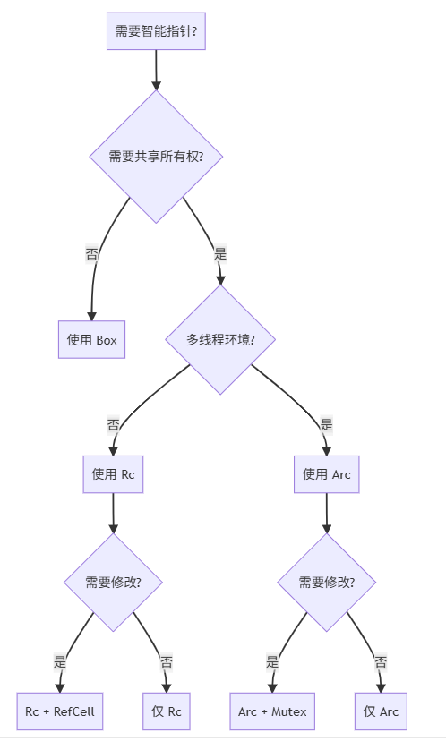

# 第六章 Rust/C++ 智能指针

智能指针是相对于普通指针，实现高级内存管理模式的一种工具，通常由原子计数和RAII共同实现。

## C++ 智能指针

对于笔者来说，C++ 的智能指针主要有`std::unique_ptr<T>`、`std::shared_ptr<T>`、`std::weak_ptr<T>`，分别对应了独占式智能指针、共享式智能指针、弱引用智能指针。其使用场景可以大概分为如下三类：

独占式智能指针：`std::unique_ptr<T>`，其指向的对象在任何时候只能有一个智能指针指向它，当智能指针被销毁时，其所指向的对象也会被销毁。通常用于通信，资源向下传递，上次函数调用不再使用，通常搭配`std::move`一起使用。

共享式智能指针：`std::shared_ptr<T>`，其指向的对象可以有多个智能指针指向它，当最后一个智能指针被销毁时，其所指向的对象也会被销毁。通常用于资源共享，例如多个线程共享同一份资源。配合`std::lock_guard<T>`等一起使用。

弱引用智能指针：`std::weak_ptr<T>`，其指向的对象可以有多个智能指针指向它，但是当最后一个智能指针被销毁时，其所指向的对象不会被销毁。通常用于解决循环引用问题，例如两个对象相互引用，导致它们的引用计数永远不会为0；还有就是线程循环执行时，收到的指针为weak_ptr，调用`lock()`升级为`std::shared_ptr<T>`时的指针有效性检查，若指针过期，则返回空指针，避免了空指针解引用的问题。

## Rust 智能指针

相较于C++，Rust的智能指针更多有`Box<T>`、`Rc<T>`、`Arc<T>`、`RefCell<T>`。下面对其进行表格归纳。

|类型|所有权|线程安全｜运行时开销｜使用场景｜
|`&T`|借用|是|零|默认选择|
|`Box<T>`|独占|是|堆分配|递归类型|
|`Rc<T>`|共享|否|引用计数|单线程共享|
|`Arc<T>`|共享|是|原子计数|多线程共享|
|`RefCell<T>`|独占|否|运行时检查|内部可变性|

### `Box<T>`

```rust,edition2024
// 堆分配值
let b = Box::new(1);
println!("b = {}", b);

// 堆分配String
let x = Box::new(String::from("hello"));

let boxed = Box::new(2);
let value = *boxed + 2;
println!("value = {}", value);

// 递归类型使用
// 例：单链表实现
// ❌ 编译错误：无限大小
// enum List {
//     Cons(i32, List),
//     Nil,
//}

// ✅ 使用 Box 解决
enum List {
    Cons(i32, Box<List>),
    Nil,
}

impl std::fmt::Display for List {
    fn fmt(&self, f: &mut std::fmt::Formatter<'_>) -> std::fmt::Result {
        match self {
            List::Cons(val, next) => {
                f.write_str(format!("Cons({}, {})", val, next).as_str())
            }
            List::Nil => {
                f.write_str("Nil")
            }
        }
    }
}

// 实现类似于C++的虚函数动态多态
// 暂没有方法支持C++的函数模板和函数重载的静态多态
trait Human {
    fn eat(&self) -> &str;
}

struct Vegetarian;
struct Meatatarian;

impl Human for Vegetarian {
    fn eat(&self) -> &str {
        "vegetable"
    }
}

impl Human for Meatatarian {
    fn eat(&self) -> &str {
        "meat"
    }
}


fn main() {
    let list = List::Cons(1, Box::new(List::Cons(2, Box::new(List::Nil))));
    println!("{}", list);
    let humans = vec![
        Box::new(Vegetarian),
        Box::new(Meatatarian),
    ];
    for human in humans {
        println!("{}", human.eat());
    }
}
```

### `Rc<T>`

单线程引用计数，实际编码中没有使用过。

```rust,edition2024
use std::rc::Rc;

// 共享数据结构,例如二叉树，多叉树，节点通常需要被多个子节点引用，这个时候使用Rc<T>可以方便的共享数据节点而不是复制整个节点
struct Node {
    value: i32,
    children: Vec<Rc<Node>>,
}

fn main() {
    let leaf = Rc::new(Node {
        value: 1,
        children: vec![],
    });
    let branch = Rc::new(Node {
        value: 2,
        children: vec![Rc::clone(&leaf)],
    });
}
```

### `RefCell<T>`

通过`UnsafeCell<T>` + 两个计数器(borrow_flag)用于记录当前是不可变借用还是可变借用，运行时检查计数是否为0；
冲突会panic以此来模拟编译期的借用检查。通常用于惰性缓存、内部状态机。

```rust,edition2024
use std::cell::RefCell;

fn main() {
    let data = RefCell::new(5);

    // 不可变借用
    let r1 = data1.borrow();
    let r2 = data2.borrow();
    println!("r1 = {}, r2 = {}", r1, r2);
    drop(r1);
    drop(r2);

    // 可变借用
    let mut r3 = data.borrow_mut();
    *r3 += 1;
    println!("r3 = {}", r3);
    drop(r3);

    let r4 = data.borrow();
    // ❌ 运行时panic
    // let r5 = data.borrow_mut(); // panic
    let r5 = data.try_borrow_mut();
    match r5 {
        Ok(mut r5) => {
            *r5 += 1;
            println!("r5 = {}", r5);
        }
        Err(_) => {
            println!("r5 borrow_mut failed");
        }
    }
}

```

## 如何选择

可以参考该图选择合适的智能指针。

资料参考[Smart Pointers](https://doc.rust-lang.org/book/ch15-00-smart-pointers.html)

## 其他

关于智能指针，C++里会经常见到`std::move`, `std::forward`等操作。

### 引入规则

#### 规则1(引用折叠原则)：如果间接的创建一个引用的引用，则这些引用会折叠

- 一般情况下，引用折叠成一个普通的左值引用类型
  - `X& &`\ `X& &&`\ `X&& &` 转换为`X&`（带引用就是左值）
  - `X&& &&` 转换为`X&&`

#### 规则2(值类别转换原则)：当将一个左值传递给一个参数是右值引用的函数，且此右值引用指向模板类型参数(`T&&`)时，编译器推断该模板参数类型为实参的左值引用

```C++
template<typename T>
void f(T&&);
int i = 42;
f(i);
```

上述模板参数类型T推断为int&类型，而非int。

#### 规则3：可通过static_cast显示转换左值到右值

`move`函数就是将对应参数转为右值，标准库中`move`定义如下：

```C++
template<typename T>
// 根据规则2，可以接受左值和右值
typename remove_reference<T>::type &&move(T&& t) {
    // 如果是右值，则直接返回右值引用
    // 根据规则3，如果是左值，则通过static_cast转换为右值引用
    return static_cast<typename remove_reference<T>::type &&>(t);
}
```

`forward`又叫完美转发，标准库中`foward`（完美转发）实现如下：

```C++
template<typename _Tp>
    constexpr _Tp&&
    // 这里就是只接受左值引用
    forward(typename std::remove_reference<_Tp>::type& __t) noexcept
    // 左值引用&&推导最终还是左值
    { return static_cast<_Tp&&>(__t); }

template<typename _Tp>
    constexpr _Tp&&
    // 这里就只接受右值
    forward(typename std::remove_reference<_Tp>::type&& __t) noexcept
    {
        // 如果收到了左值，会编译期报错
        static_assert(!std::is_lvalue_reference<_Tp>::value, "template argument substituting _Tp is an lvalue reference type");
        return static_cast<_Tp&&>(__t);
    }

```
